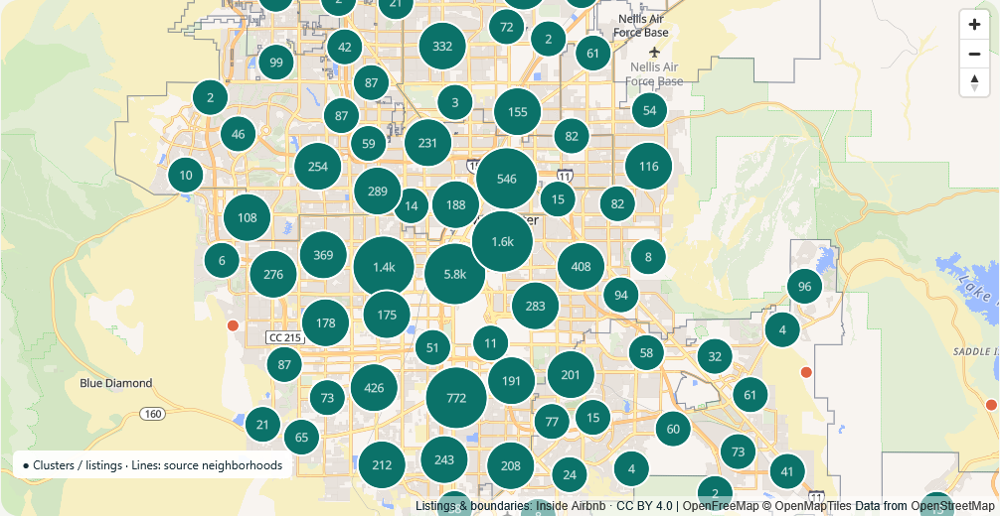
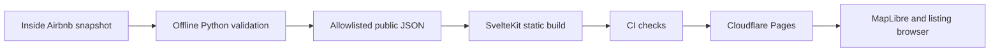

# Las Vegas STR Explorer

[**Try the live demo → str.housev.dev**](https://str.housev.dev) · [Development issues](https://github.com/kenner1-unlv/vegas-str-ml/issues?q=is%3Aissue) · [Pull requests](https://github.com/kenner1-unlv/vegas-str-ml/pulls) · [CI and deployments](https://github.com/kenner1-unlv/vegas-str-ml/actions)

A public map for exploring advertised Airbnb nightly prices across the Las Vegas Valley. The engineering focus is a reproducible data pipeline, an interactive geographic client, honest data limitations and verified static delivery. The repository name includes ML; the current release is a descriptive explorer, with model work still planned.



*Screenshot from the local production preview, October 7, 2026; the live demo is the current release.*

## Try it in two minutes

1. Open the [demo](https://str.housev.dev). The September 20, 2026 snapshot contains 17,212 usable listings from 20,651 source rows.
2. Choose **City of Henderson** to inspect its 784-listing sample. Reset, then set the maximum asking price to **100** to see 2,853 matching listings.
3. Zoom into a map cluster or choose a listing from the keyboard-accessible listing browser. Compare its asking price, room type, bedrooms and source neighborhood.
4. Return through the demo's **Source code & development history** footer link to inspect the implementation and evidence below.

Asking prices are not realized revenue. Unavailable calendar nights are not confirmed bookings. Approximate points and source neighborhood labels do not establish parcel matches or legal eligibility. No housing-cost integration, occupancy estimate, trained model or investment ranking is shipped.

## Follow the development trail

| Stage | What to inspect | Evidence / status |
| --- | --- | --- |
| Explorer and ingestion | [Foundation record #1](https://github.com/kenner1-unlv/vegas-str-ml/issues/1), [initial implementation](https://github.com/kenner1-unlv/vegas-str-ml/commit/b5e8b80) | Implemented; retrospective issue recorded after delivery |
| Production delivery | [Deployment record #2](https://github.com/kenner1-unlv/vegas-str-ml/issues/2), [delivery commit](https://github.com/kenner1-unlv/vegas-str-ml/commit/739a55a) | [Successful CI + Pages deployment](https://github.com/kenner1-unlv/vegas-str-ml/actions/runs/37738181925), attempt 2 |
| Portfolio documentation | [Issue #3](https://github.com/kenner1-unlv/vegas-str-ml/issues/3), [PRs](https://github.com/kenner1-unlv/vegas-str-ml/pulls?q=is%3Apr+head%3Adocs%2Fportfolio-development-trail) | Proposed through a PR; review and merge are separate |
| Hosting follow-up | [Issue #4](https://github.com/kenner1-unlv/vegas-str-ml/issues/4) | Pages dashboard verification and duplicate Worker build-trigger cleanup remain |
| Housing costs | [Issue #5](https://github.com/kenner1-unlv/vegas-str-ml/issues/5) | Future: licensing, geographic coverage and benchmark validation |
| Advertised-price ML | [Issue #6](https://github.com/kenner1-unlv/vegas-str-ml/issues/6) | Future: baseline-first, grouped geographic evaluation |

The foundation and deployment were originally committed directly to main. Issues #1 and #2 document that work retrospectively; they do not imply earlier issue planning or PR reviews. New changes follow the [issue → branch → PR → CI → merge → deployment procedure](CONTRIBUTING.md).

## Engineering walkthrough

- **Data pipeline:** [pipeline/ingest.py](pipeline/ingest.py) streams and validates pinned source downloads, verifies SHA-256 for offline reprocessing, exports allowlisted records and publishes the index last. [Sources and provenance](docs/data-sources.md) document exclusions, licensing and quality.
- **Interactive client:** [Map.svelte](web/src/lib/Map.svelte) clusters the filtered sample, bundles its map worker and preserves string IDs; [data.ts](web/src/lib/data.ts) validates the client contract. The listing browser remains usable when WebGL or tile requests fail.
- **Delivery:** [CI workflow](.github/workflows/ci.yml) gates production Pages uploads on frontend and Python checks and reuses the verified build artifact. [Deployment](docs/deployment.md) describes ownership, secrets by name, recovery and the separate legacy Worker.
- **Evidence:** [Verification](docs/verification.md) separates historical local checks, fresh hosted browser checks and the successful hosted deployment. [Decisions](docs/decisions.md) explains technical tradeoffs; [methodology](docs/methodology.md) distinguishes descriptive statistics from future model/scenario claims.



## Run locally

Requirements: Node 24, pnpm 12.10.1; Python 3.12+ and uv for pipeline development. CI uses Python 3.14. Compact public artifacts are checked in, so running the demo requires no data download or credentials.

```powershell
git clone https://github.com/kenner1-unlv/vegas-str-ml.git
cd vegas-str-ml
npx.cmd --yes pnpm@12.10.1 --dir web install --frozen-lockfile
npx.cmd --yes pnpm@12.10.1 --dir web dev
```

On Linux/macOS use npx instead of npx.cmd. Open the Vite URL printed in the terminal. Optional map-style configuration is documented in web/.env.example. See [contribution checks](CONTRIBUTING.md) for frontend/Python verification commands and [deployment](docs/deployment.md) for production delivery.

For a deliberate dataset refresh, from repository root:

```powershell
uv sync --project pipeline --locked
uv run --project pipeline python pipeline/ingest.py --snapshot 2026-09-20
# Requires previously downloaded raw files; verifies checksums, no network:
uv run --project pipeline python pipeline/ingest.py --snapshot 2026-09-20 --offline
```

Review provenance and quality before publishing. Raw files stay ignored. CI never downloads full datasets; calendar/review research downloads are optional and do not feed booking estimates.

## Data, license and roadmap

Derived from [Inside Airbnb Clark County](https://insideairbnb.com/get-the-data/), snapshot 2026-09-20, retrieved October 7, 2026 Pacific. Filtering and allowlisting are our modifications. Data attribution: [CC BY 4.0](https://creativecommons.org/licenses/by/4.0/); map attribution is visible in the app. Host/reviewer data, descriptions, secrets, raw datasets and model binaries are excluded from public outputs. Application code has no selected redistribution license yet.

See [scope and remaining milestones](docs/scope.md). Regional housing benchmarks, ML evaluation, scenario analysis and refresh operations require additional evidence; they are not presented as completed features.
